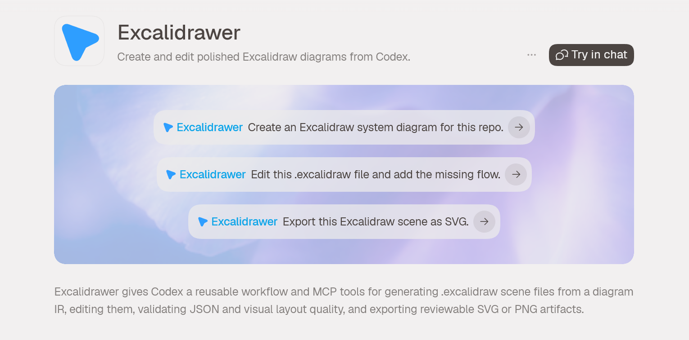

# Excalidrawer

Excalidrawer is a Codex plugin and MCP server for creating, editing, validating, and exporting Excalidraw scene files.

## Install

### Codex marketplace

Add the repository marketplace source:

```bash
codex plugin marketplace add yappologistic/Excalidrawer --ref main
codex plugin marketplace list
```

Restart Codex, open **Plugins**, choose the **Excalidrawer** marketplace source, and install **Excalidrawer**. The committed marketplace catalog lives at `.agents/plugins/marketplace.json` and points Codex at the plugin bundle in `./plugin`.

### NPX personal install

```bash
npx -y github:yappologistic/Excalidrawer install
```

The installer copies the plugin bundle to `~/.codex/plugins/excalidrawer`, writes a personal marketplace entry at `~/.agents/plugins/marketplace.json`, and rewrites the installed MCP config to launch the current built CLI. Restart Codex after installation, then install `excalidrawer` from the personal marketplace and start a new thread.

Useful lifecycle commands:

```bash
npx -y github:yappologistic/Excalidrawer check
npx -y github:yappologistic/Excalidrawer reinstall
npx -y github:yappologistic/Excalidrawer uninstall
```

`reinstall` is the command to use after pulling updates. Start a new Codex thread after reinstalling so new skill and MCP metadata are loaded.

## CLI Usage

```bash
excalidrawer create --prompt "client calls API and API queues work" --out diagram.excalidraw
excalidrawer create --prompt "architecture: frontend calls API, API writes Postgres, worker consumes queue" --out architecture.excalidraw
excalidrawer edit diagram.excalidraw --add-text "retry failed jobs"
excalidrawer read diagram.excalidraw
excalidrawer validate diagram.excalidraw
excalidrawer export diagram.excalidraw --format svg --out diagram.svg
excalidrawer export diagram.excalidraw --format png --out diagram.png
excalidrawer gallery
excalidrawer import --format mermaid --in diagram.mmd --out imported.excalidraw
excalidrawer recipe c4-container --out c4.excalidraw
excalidrawer repair broken.excalidraw --out repaired.excalidraw
excalidrawer diff before.excalidraw after.excalidraw --out diff.json
excalidrawer library --out components.excalidrawlib
excalidrawer harness diagram.excalidraw --out harness.html
excalidrawer visual-regression diagram.excalidraw --out visual-report.json
excalidrawer visual-regression diagram.excalidraw --baseline-hash <previous-hash> --out visual-report.json
excalidrawer visual-regression gallery --out visual-gallery.json
excalidrawer doctor browser --scene diagram.excalidraw --out doctor.json
```

## Diagram Compiler

Complex prompts are compiled through an internal Diagram IR before Excalidraw JSON is written. The IR tracks nodes, typed edges, groups, lanes, clusters, annotations, primitives, subdiagrams, layout hints, visual grammar, and review metadata, which keeps prompt parsing separate from layout and rendering.

Supported layout intents are `flow`, `architecture`, `sequence`, `mindmap`, `data-flow`, `state-machine`, `swimlane`, and `incident-response`. Prefix a prompt with an intent such as `architecture:` or `swimlane:` to select one explicitly; otherwise Excalidrawer infers a reasonable default from the prompt.

Prompts with relationship verbs such as `calls`, `writes`, `queues`, `manages`, `depends`, or `transitions` are routed through the strict compiler even when they do not include an explicit prefix. This keeps ordinary user requests on the same typed-edge, family-aware path as advanced prompts instead of falling back to a generic box diagram.

The compiler also classifies prompts into strict diagram families. The core catalog covers `flowchart`, `architecture-c4`, `sequence`, `state-machine`, `swimlane`, `data-flow`, `uml-class`, `uml-use-case`, `uml-activity`, `bpmn-process`, `network`, `org-chart`, `timeline`, `dependency-graph`, `mindmap`, `incident-response`, and `threat-model`. Family metadata is stored in the IR, `appState.excalidrawerReview`, and SVG `data-excalidrawer-*` attributes so agents and reviewers can verify that a UML, DFD, BPMN-like, network, or org-chart request did not silently fall back to a generic flowchart.

The compiler now renders semantic node shapes instead of only boxes. Actors and databases use ellipses, queues/states/alerts use diamonds, services/processes/metrics use rounded rectangles, and each node gets a compact text-based icon marker that stays inside the Excalidraw primitive model. Edges are typed from verbs such as `calls`, `writes`, `consumes`, and `notifies`; typed arrows use distinct color/style treatment and visible edge labels.

Advanced prompts can request richer diagram structure. Excalidrawer recognizes trust boundaries, event buses, deployment/data zones, subdiagram expansion such as `expand API internals`, layout hints such as `put databases at bottom`, and semantic decorations such as `mark API critical and PII`. It renders these as supported Excalidraw elements with `customData` metadata, auto-generates a legend from the visual grammar, assigns stable route groups and route lanes to typed arrows, and stores a review summary in `appState.excalidrawerReview`.

Next-generation prompts can also request reusable diagram patterns, domain packs, layout profiles, style presets, imported-source provenance, progressive detail, compound components, ports/anchors, critic checks, and golden visual fixtures. Example:

```bash
excalidrawer create --prompt "domain: ecommerce pattern: strangler migration profile: spacious preset: boardroom import: yaml detail: deep architecture detailed: buyer calls storefront, storefront calls checkout API, checkout API writes orders database, checkout API publishes payment event bus" --out ecommerce.excalidraw
```

These features are stored in the Diagram IR and scene app state (`excalidrawerDomainPack`, `excalidrawerLayoutProfile`, `excalidrawerStylePreset`, `excalidrawerImportedSource`, `excalidrawerProgressiveDetail`, and `excalidrawerGoldenFixture`). When explicitly requested, Excalidrawer renders side-panel review cards for patterns, compound components, progressive detail, critic score, and port/anchor markers without placing helper graphics over the main diagram.

Each layout intent has an explicit renderer spec in the scene app state. Review metadata records the selected renderer, grammar summary, optimizer attempt count, selected attempt, and per-attempt quality issues so agents can explain why a layout passed or failed instead of returning an opaque board.

Reusable templates cover every layout intent plus `system-architecture`. Complexity modes (`compact`, `balanced`, `detailed`) adjust spacing and annotation density. Run `excalidrawer gallery` to compile and score the built-in gallery cases across `.excalidraw` JSON and SVG export metadata.

Reusable themes are `technical`, `executive`, `handdrawn`, `minimal`, `system-architecture`, and `incident-response`. Themes define fills, group/lane colors, stroke weights, roughness, font size, and arrow color.

## MCP Tools

The plugin exposes a stdio MCP server through `npx -y github:yappologistic/Excalidrawer mcp`.

Tools:

- `create_scene`: create an `.excalidraw` file from a prompt.
- `edit_scene`: add text to an existing scene.
- `read_scene`: summarize an existing scene.
- `validate_scene`: validate scene JSON and return user-friendly quality explanations.
- `export_scene`: export SVG or PNG review artifacts.
- `import_structured_scene`: import Mermaid, PlantUML, Graphviz DOT, OpenAPI, Terraform, Docker Compose, Kubernetes, or package dependency text.
- `create_recipe_scene`: list or generate named recipes such as `c4-container`, `incident-timeline`, `service-map`, `data-lineage`, `deployment-topology`, `queue-worker-system`, and `auth-flow`.
- `repair_scene`: repair structurally valid but visually invalid scenes by rebuilding a cleaner layout from visible labels.
- `diff_scenes`: compare two scene files by added/removed labels, position changes, and element delta.
- `export_library_pack`: create an `.excalidrawlib` pack with reusable architecture components.
- `create_renderer_harness`: write a self-contained HTML/SVG harness for Browser visual QA without unpinned remote scripts.
- `run_visual_regression`: hash SVG output for single scenes or the curated recipe gallery.
- `doctor_browser`: check local preview inputs, SVG geometry, and browser-automation readiness.

## Development

```bash
npm install
npm run build
npm test
```

## Quality Gate

Scene validation now checks more than JSON shape. Generated, edited, and exported scenes must pass deterministic layout checks for visible overlap, cramped spacing, canvas bounds, centered container text, normalized bound arrows, visible arrowheads, and arrow routes that do not cross labels or unrelated content. Strict family contracts also reject missing notation roles, missing connector semantics, and generic-flowchart fallback for known diagram families. The CLI and MCP `validate` commands report these issues and include diagram review metadata before a scene is returned.

The compiler also runs an iterative quality loop. It generates a layout, scores it, retries with wider spacing when needed, and fails closed with concrete quality issues instead of returning a broken board.

Gallery verification is part of the development gate. It exercises flow, architecture, sequence, mindmap, data-flow, state-machine, swimlane, incident-response, system-architecture templates, and the `architecture-ecommerce-spacious` golden fixture, then checks both scene quality and SVG semantic metadata.

The advanced verification commands add a second layer:

- `harness` creates a safe localhost/file preview page for in-browser inspection. It does not run the Excalidraw browser runtime.
- `visual-regression gallery` records deterministic full SHA-256 SVG hashes for curated complex diagrams.
- `doctor browser` checks local preview artifacts and SVG geometry. Static SVG harness does not prove browser-runtime parity, so runtime-specific Excalidraw availability is reported as a separate warning when no vetted local runtime is present.

The `.excalidraw` JSON file is the source of truth. SVG exports include readable centered labels, routed arrow polylines, and a defined arrowhead marker. PNG exports include layout, arrow routes, and text-marker placement. Both are deterministic Node-generated review artifacts because Excalidraw's official browser renderer depends on DOM and canvas APIs.

## Troubleshooting

- `check` reports missing plugin files: run `reinstall`, restart Codex, and open a new thread.
- The plugin is not visible in Codex after marketplace install: run `codex plugin marketplace list`, confirm `Excalidrawer` is listed, then restart Codex.
- The plugin is not visible after NPX install: confirm `~/.agents/plugins/marketplace.json` contains an `excalidrawer` entry pointing at `./.codex/plugins/excalidrawer`, then restart Codex.
- `npx -y github:yappologistic/Excalidrawer ...` fails during install: confirm Git and Node 20+ are available.
- PNG/SVG output does not exactly match Excalidraw's browser renderer: use the `.excalidraw` file as canonical and open it in Excalidraw for exact rendering.
